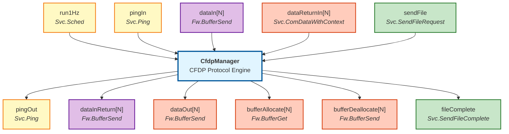

# CfdpManager Component Diagram

```mermaid
flowchart TB
    %% Top ports (System)
    run1Hz["run1Hz<br/><i>Svc.Sched</i>"]
    pingIn["pingIn<br/><i>Svc.Ping</i>"]
    pingOut["pingOut<br/><i>Svc.Ping</i>"]

    %% Left ports (Uplink)
    dataIn["dataIn[N]<br/><i>Fw.BufferSend</i>"]
    dataInReturn["dataInReturn[N]<br/><i>Fw.BufferSend</i>"]

    %% Component box
    CfdpManager["<b>CfdpManager</b><br/>CFDP Protocol Engine"]

    %% Right ports (Downlink)
    dataOut["dataOut[N]<br/><i>Fw.BufferSend</i>"]
    dataReturnIn["dataReturnIn[N]<br/><i>Svc.ComDataWithContext</i>"]
    bufferAllocate["bufferAllocate[N]<br/><i>Fw.BufferGet</i>"]
    bufferDeallocate["bufferDeallocate[N]<br/><i>Fw.BufferSend</i>"]

    %% Bottom ports (File Transfer)
    sendFile["sendFile<br/><i>Svc.SendFileRequest</i>"]
    fileComplete["fileComplete<br/><i>Svc.SendFileComplete</i>"]

    %% Top connections
    run1Hz --> CfdpManager
    pingIn --> CfdpManager
    CfdpManager --> pingOut

    %% Left connections
    dataIn --> CfdpManager
    CfdpManager --> dataInReturn

    %% Right connections
    CfdpManager --> dataOut
    dataReturnIn --> CfdpManager
    CfdpManager --> bufferAllocate
    CfdpManager --> bufferDeallocate

    %% Bottom connections
    sendFile --> CfdpManager
    CfdpManager --> fileComplete

    %% Styling
    classDef systemPort fill:#fff9c4,stroke:#f57f17,stroke-width:2px
    classDef uplinkPort fill:#e1bee7,stroke:#6a1b9a,stroke-width:2px
    classDef downlinkPort fill:#ffccbc,stroke:#d84315,stroke-width:2px
    classDef filePort fill:#c8e6c9,stroke:#2e7d32,stroke-width:2px
    classDef component fill:#e1f5ff,stroke:#01579b,stroke-width:3px

    class run1Hz,pingIn,pingOut systemPort
    class dataIn,dataInReturn uplinkPort
    class dataOut,dataReturnIn,bufferAllocate,bufferDeallocate downlinkPort
    class sendFile,fileComplete filePort
    class CfdpManager component
```