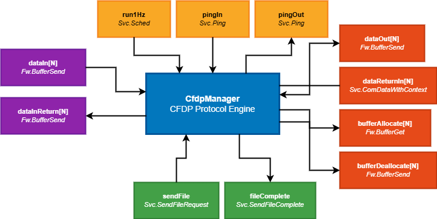
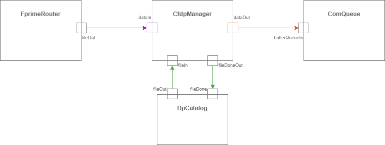
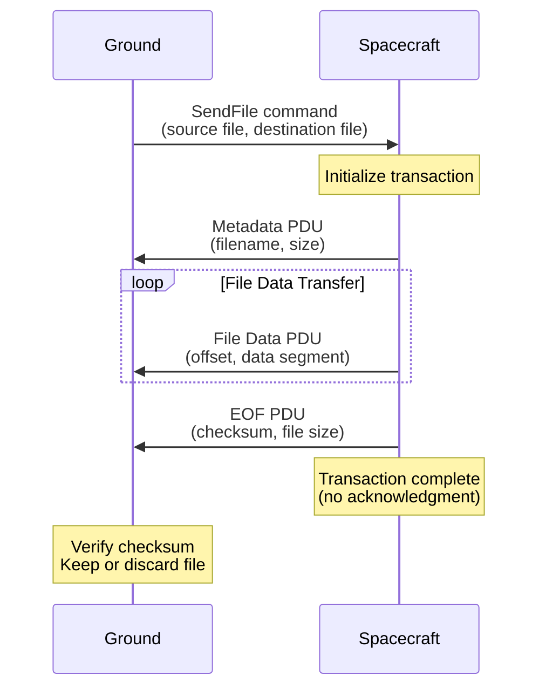
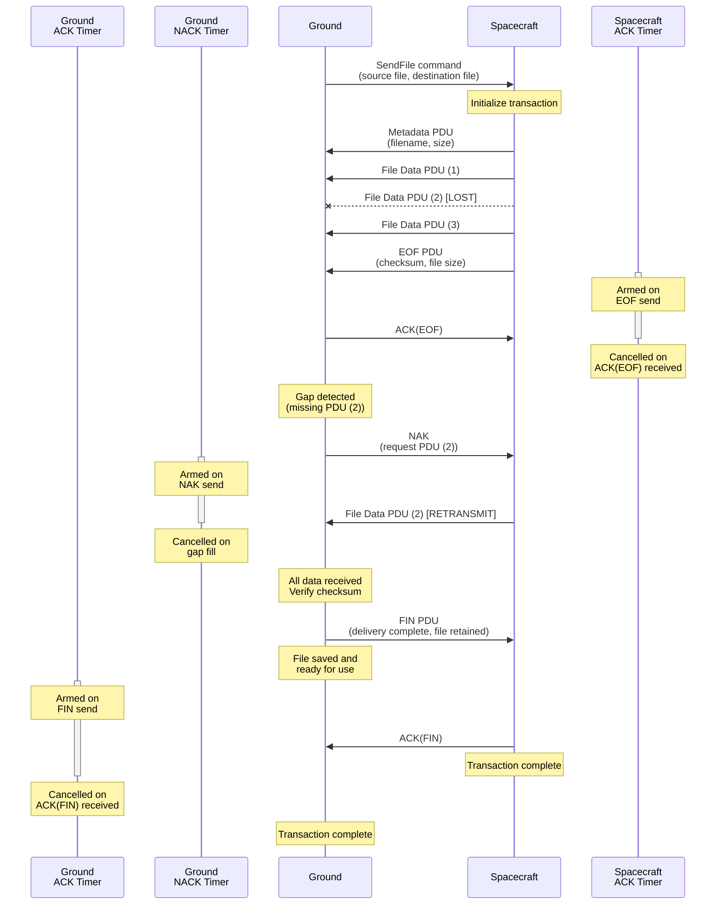
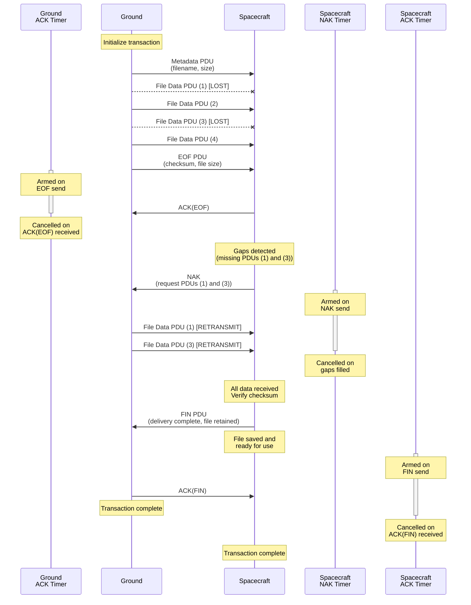

# Ccsds::CfdpManager

## CFDP Introduction

The CCSDS File Delivery Protocol (CFDP) is a space communication standard designed for reliable, autonomous file transfer in space missions. CFDP provides a robust mechanism for transferring files between ground systems and spacecraft even in environments with long propagation delays, intermittent connectivity, or high error rates.

CFDP is particularly well-suited for:
- Spacecraft-to-ground file transfers: Downlinking F' event logs, telemetry data files, science data products, and diagnostic files
- Ground-to-spacecraft file transfers: Uplinking F' flight software updates, parameter files, and command sequences
- Delay-tolerant and disruption-tolerant delivery: Automatic retry and recovery mechanisms for challenging communication links

The protocol supports two operational modes:
- Class 1 (Unacknowledged): Unreliable transfer with no acknowledgments, suitable for real-time or non-critical data where speed is prioritized
- Class 2 (Acknowledged): Reliable transfer with acknowledgments, retransmissions, and gap detection, ensuring complete and verified file delivery

### Protocol Data Units (PDUs)

CFDP uses Protocol Data Units (PDUs) - structured messages with a common header and type-specific payloads:

 - Metadata: Initiates transfer with filenames, file size, and options
 - File Data: Carries file content segments with offset information
 - EOF: Signals completion of file transmission with checksum
 - FIN: Reports final delivery status (Class 2 only)
 - ACK: Confirms receipt of EOF or FIN (Class 2 only)
 - NAK: Requests retransmission of missing segments (Class 2 only)

For complete protocol details, refer to the [CCSDS 727.0-B-5 - CCSDS File Delivery Protocol (CFDP)](https://ccsds.org/Pubs/727x0b5e1.pdf) Blue Book specification.

## CFDP as an F' Component

The CfdpManager component provides an F' implementation of the CFDP protocol and is designed to replace the standard F' [FileUplink](../../../FileUplink/docs/sdd.md) and [FileDownlink](../../../FileDownlink/docs/sdd.md) components with the addition of guaranteed file delivery. CfdpManager implements both CFDP Class 1 and Class 2 protocols, providing options for both unacknowledged and acknowledged transfers with retransmissions, gap detection, and reliable file delivery even over lossy or intermittent communication links.

Substantial portions of this implementation were ported from [NASA's CF (CFDP) Application in the Core Flight System (cFS) version 3.0.0](https://github.com/nasa/CF/releases/tag/v3.0.0). The ported code includes:
- Core CFDP engine and transaction management logic
- Protocol state machines for transmit and receive operations
- Utility functions for file handling and resource management
- Chunk and gap tracking for Class 2 transfers

The F' implementation adds new components built specifically for the F' ecosystem:
- CfdpManager component wrapper: Integrates CFDP into F' architecture with standard port interfaces, commands, events, telemetry, and parameters
- Object-oriented PDU encoding/decoding: Type-safe PDU classes based on F' `Serializable` interface for consistent serialization
- F' timer implementation: Uses F' time primitives for protocol timers

For detailed attribution, licensing information, and a breakdown of ported vs. new code, see [ATTRIBUTION.md](../ATTRIBUTION.md).

## Class Diagram

The CfdpManager component diagram shows the port organization by functional grouping:

Ports are organized as follows:
- **Top (System Ports)**: Scheduling and system health - `run1Hz`, `pingIn`, `pingOut`
- **Left (Uplink Ports)**: Receive CFDP PDUs from remote entities - `dataIn`, `dataInReturn`
- **Right (Downlink Ports)**: Send CFDP PDUs to remote entities - `dataOut`, `dataReturnIn`, `bufferAllocate`, `bufferDeallocate`
- **Bottom (File Transfer Ports)**: Port-based file send interface - `fileIn`, `fileDoneOut`

### Port Descriptions

#### System Ports

| Name | Type | Port Type | Description |
|------|------|-----------|-------------|
| run1Hz | async input | `Svc.Sched` | Scheduler port that must be invoked at 1 Hz to drive CFDP protocol timer logic, transaction processing, and state machine execution |
| pingIn | async input | `Svc.Ping` | Health check input port for liveness monitoring |
| pingOut | output | `Svc.Ping` | Health check output port for responding to pings |

#### Downlink Ports

| Name | Type | Port Type | Description |
|------|------|-----------|-------------|
| dataOut | output array[N] | `Fw.BufferSend` | Send encoded CFDP PDU data buffers to downstream components. One port (`N`) per CFDP channel. |
| dataReturnIn | async input array[N] | `Svc.ComDataWithContext` | Receive buffers previously sent via `dataOut` after downstream processing is complete. One port per CFDP channel. |
| bufferAllocate | output array[N] | `Fw.BufferGet` | Request allocation of buffers for constructing outgoing CFDP PDUs. One port (`N`) per CFDP channel. |
| bufferDeallocate | output array[N] | `Fw.BufferSend` | Return/deallocate buffers that were allocated but not sent (e.g., due to errors). One port (`N`) per CFDP channel. |

#### Uplink Ports

| Name | Type | Port Type | Description |
|------|------|-----------|-------------|
| dataIn | async input array[N] | `Fw.BufferSend` | Receive incoming CFDP PDU data buffers from upstream components (e.g., deframing, radio). One port (`N`) per CFDP channel. |
| dataInReturn | output array[N] | `Fw.BufferSend` | Return buffers received via `dataIn` after PDU processing is complete. One port (`N`) per CFDP channel. |

#### File Transfer Ports

| Name | Type | Port Type | Description |
|------|------|-----------|-------------|
| fileIn | guarded input | `Svc.SendFileRequest` | Programmatic file send request interface. Allows other components to initiate CFDP file transfers without using commands. Transaction arguments are populated from component parameters: `FileInDefaultChannel`, `FileInDefaultDestEntityId`, `FileInDefaultClass`, `FileInDefaultKeep`, and `FileInDefaultPriority`. The `offset` and `length` parameters are currently unsupported and must be `0`, or `STATUS_INVALID` is returned|
| fileDoneOut | output | `Svc.SendFileComplete` | Asynchronous notification of file transfer completion for transfers initiated via `fileIn` port. Provides final transfer status. Only invoked for port-initiated transactions (not command-initiated). |

## Usage Examples

The following diagram shows typical CfdpManager port connections with other F' components:

This example demonstrates:
- **Uplink data flow**: FprimeRouter deframes incoming CFDP PDUs and sends them to CfdpManager via `dataIn`
- **Downlink data flow**: CfdpManager sends outgoing CFDP PDUs to ComQueue via `dataOut` for transmission
- **Port-based file transfers**: DpCatalog initiates file transfers via CfdpManager's `fileIn` port and receives completion notifications via `fileDoneOut`

## Component Design

### Assumptions

The design of `CfdpManager` assumes the following:

1. File transfers occur by exchanging CFDP Protocol Data Units (PDUs) as defined in CCSDS 727.0-B-5.

2. PDUs are transported in buffers provided by downstream components via the `bufferAllocate` port for transmission and received via the `dataIn` port from upstream components.

3. Multiple file transfers can occur simultaneously, managed across configurable channels with independent transaction pools.

4. Files are stored on non-volatile storage accessible via standard file I/O operations.

5. The `run1Hz` port is invoked periodically at 1 Hz to drive protocol timers and state machine execution.

6. For Class 2 transfers, the remote entity implements the CFDP protocol correctly and responds to PDUs according to the specification.

7. Received files are written to a temporary directory (`ChannelConfig.tmp_dir` per-channel parameter) during transfer and moved to their final destination upon successful completion.

8. Port-initiated file transfers (via `fileIn`) use default configuration parameters (`FileInDefaultChannel`, `FileInDefaultDestEntityId`, `FileInDefaultClass`, `FileInDefaultKeep`, and `FileInDefaultPriority`).

### Main Class Hierarchy

CfdpManager ([CfdpManager.hpp](../CfdpManager.hpp))
- Top-level F' component that integrates CFDP into the F' framework
- Provides F' port handlers for commands, data input/output, and periodic execution
- Owns a single Engine instance and delegates all protocol operations to it
- Manages component parameters and provides events/telemetry to the F' system

Engine ([Engine.hpp](../Engine.hpp))
- Core protocol engine that manages CFDP lifecycle and operations
- Owns multiple Channel instances (one per configured CFDP channel)
- Handles PDU routing and dispatching to appropriate transactions
- Manages transaction creation, initialization, and cleanup
- Implements top-level protocol state machine coordination

Channel ([Channel.hpp](../Channel.hpp))
- Encapsulates channel-specific operations and configuration
- Owns a pool of Transaction instances for that channel
- Manages playback directories and polling directories
- Handles transaction queuing with priority-based scheduling
- Controls flow state (normal/frozen) and PDU throttling

Transaction ([Transaction.hpp](../Transaction.hpp))
- Represents individual file transfer operations
- Implements both TX (transmit) and RX (receive) state machines
- Handles Class 1 (unacknowledged) and Class 2 (acknowledged) protocol states
- Implementation split across [TransactionTx.cpp](../TransactionTx.cpp) and [TransactionRx.cpp](../TransactionRx.cpp)
- Manages file I/O, checksums, timers, and retry logic for each transaction

### PDU Type Hierarchy

PduBase ([Types/PduBase.hpp](../Types/PduBase.hpp))
- Abstract base class for all CFDP Protocol Data Units
- Inherits from F' `Fw::Serializable` for consistent encoding/decoding
- Contains common `PduHeader` with transaction identification

Concrete PDU types (all in [Types/](../Types/) directory):
- MetadataPdu ([MetadataPdu.hpp](../Types/MetadataPdu.hpp)): Initiates file transfer with filename, size, and options
- FileDataPdu ([FileDataPdu.hpp](../Types/FileDataPdu.hpp)): Carries file data segments with offset information
- EofPdu ([EofPdu.hpp](../Types/EofPdu.hpp)): Signals end of file transmission with checksum and final size
- FinPdu ([FinPdu.hpp](../Types/FinPdu.hpp)): Indicates transaction completion with delivery status (Class 2 only)
- AckPdu ([AckPdu.hpp](../Types/AckPdu.hpp)): Acknowledges receipt of EOF or FIN directives (Class 2 only)
- NakPdu ([NakPdu.hpp](../Types/NakPdu.hpp)): Requests retransmission of missing file segments (Class 2 only)

### Supporting Types and Utilities

**Classes:**
- Timer ([Timer.hpp](../Timer.hpp)): CFDP timer implementation using F' time primitives for ACK timeouts and inactivity detection
- CfdpChunkList ([Chunk.hpp](../Chunk.hpp)): Gap tracking for Class 2 transfers; tracks received file segments and identifies missing data for NAK generation
- Clist ([Clist.hpp](../Clist.hpp)): Intrusive circular linked list for efficient transaction queue management

**Structs (defined in [Types.hpp](../Types/Types.hpp)):**
- History: Transaction history records for completed transfers; stores filenames, direction, status, and entity IDs
- Playback: Playback request state for directory playback and polling operations; manages directory iteration and transaction parameters
- CfdpChunkWrapper: Wrapper around CfdpChunkList for pooling and reuse across transactions

**Utilities:**
- Utils ([Utils.hpp](../Utils.hpp)): Utility functions for transaction traversal, status conversion, and protocol helpers

### Transmission and Receive Throttling

#### Transmission Throttling

Transmission throttling governs how many outgoing PDUs can be sent in a single execution cycle of the component. This mechanism prevents the CFDP engine from overwhelming downstream components (such as communication queues or radio interfaces) with excessive PDU traffic in a single scheduler invocation.

**Configuration:**

Transmission throttling is controlled by the `ChannelConfig.max_outgoing_pdus_per_cycle` parameter, which specifies the maximum number of outgoing PDUs that can be transmitted per channel per execution cycle. This limit applies to all outgoing PDU types including Metadata, File Data, EOF, ACK, NAK, and FIN PDUs.

**Implementation:**

The transmission throttling mechanism is implemented through a per-channel outgoing PDU counter that is reset at the beginning of each execution cycle. When a transaction requests a buffer to send a PDU, the implementation checks if the counter has reached the configured limit. If under the limit, the buffer is allocated and the counter is incremented. If the limit is reached, buffer allocation is denied and the transaction is deferred to the next cycle, with processing resuming from where it left off.

**Buffer Management:**

The transmission throttling mechanism works in conjunction with buffer allocation from downstream components. Two failure modes can occur: throttling limit reached (the `max_outgoing_pdus_per_cycle` limit is reached and no buffer allocation is attempted) or buffer exhaustion (the downstream buffer pool is exhausted and buffer allocation fails even when under the throttling limit). In both cases, the transaction defers PDU transmission until the next cycle by returning to a pending state and resuming processing in the next execution cycle. For Class 2 transactions, protocol timers (ACK, NAK, inactivity) continue running and will eventually trigger retransmissions or transaction abandonment if PDUs cannot be sent.

#### Receive Throttling

Unlike transmit operations that are driven by the periodic `run1Hz` scheduler port, receive operations in CfdpManager are driven by the `dataIn` async input port. Incoming CFDP PDUs arrive via this port and are processed immediately by the component's thread when the port handler is invoked, without per-cycle limits. Receive throttling was implemented in NASA's CF (CFDP) application because CF processes received PDUs during scheduled execution cycles. In contrast, CfdpManager processes incoming PDUs asynchronously as they arrive, so there is no architectural reason to throttle incoming PDUs.

## Sequence Diagrams

The following sequence diagrams illustrate the external protocol exchanges between spacecraft and ground systems during CFDP transactions. These diagrams focus on the PDU-level interactions and do not depict the internal state machine transitions or detailed transaction processing logic within the CfdpManager component.

### Class 1 TX Transaction (Unacknowledged)

This diagram shows a Class 1 file transmission from spacecraft to ground. Class 1 is unacknowledged and provides no retransmission or delivery guarantees.

**Key characteristics:**
- No acknowledgments (ACK, NAK, or FIN PDUs)
- No retransmissions or gap detection
- Sender completes immediately after sending EOF
- Receiver validates checksum and keeps/discards file independently

### Class 2 TX Transaction (Acknowledged)

This diagram shows a Class 2 file transmission from spacecraft to ground with gap detection and retransmission. The scenario includes a missing File Data PDU that is detected and retransmitted via NAK.

**Key characteristics:**
- Full acknowledgment and retransmission support
- EOF is acknowledged to confirm reception
- Ground detects missing data and sends NAK with gap information
- Spacecraft retransmits requested segments
- FIN PDU from receiver confirms final delivery status
- Timers ensure protocol progress and detect failures
  - Spacecraft ACK timer: Armed when EOF is sent with duration `ChannelConfig.ack_timer`, cancelled when ACK(EOF) or FIN is received. If the timer expires before receiving acknowledgment, the spacecraft retransmits EOF and rearms the timer. After `ChannelConfig.ack_limit` retries without acknowledgment, the transaction is abandoned with status `ACK_LIMIT_NO_EOF`
- Transaction completes only after FIN/ACK exchange

### Class 2 RX Transaction (Acknowledged)

This diagram shows a Class 2 file reception at the spacecraft from ground with gap detection and retransmission. The scenario includes a missing File Data PDU that is detected and retransmitted via NAK.

**Key characteristics:**
- Full acknowledgment and retransmission support
- EOF is acknowledged to confirm reception
- Spacecraft detects missing data and sends NAK with gap information
- Ground retransmits requested segments
- FIN PDU from receiver confirms final delivery status
- Timers ensure protocol progress and detect failures
  - Spacecraft NAK timer: Armed when NAK is sent with duration `ChannelConfig.ack_timer`, cancelled when **all** requested data is received. If the timer expires before receiving retransmitted data, the spacecraft sends another NAK and rearms the timer. After `ChannelConfig.nack_limit` retries without data, the transaction is abandoned with status `NAK_LIMIT_REACHED`
  - Spacecraft ACK timer: Armed when FIN is sent with duration `ChannelConfig.ack_timer`, cancelled when ACK(FIN) is received. If the timer expires, the spacecraft retransmits FIN and rearms the timer. After `ChannelConfig.ack_limit` retries without ACK(FIN), the transaction is abandoned
- Transaction completes only after FIN/ACK exchange

## Configuration

`CfdpManager` uses compile-time configuration defined in two files:
- **[CfdpCfg.fpp](../../../../default/config/CfdpCfg.fpp)**: FPP constants and types visible to both FPP and C++ code
- **[CfdpCfg.hpp](../../../../default/config/CfdpCfg.hpp)**: C++ preprocessor definitions for implementation details

### FPP Constants (CfdpCfg.fpp)

These constants are defined in the `Svc.Ccsds.Cfdp` module and must be configured at compile time:

| Constant | Purpose |
|----------|---------|
| `NumChannels` | Number of CFDP channels to instantiate. Determines the size of channel-specific port arrays and the number of independent CFDP channel instances. Each channel has its own transaction pool, configuration, and state. |
| `MaxFilePathSize` | Maximum length for file path strings. Used to size string parameters (`ChannelConfig.tmp_dir`, `ChannelConfig.fail_dir`, `ChannelConfig.move_dir`) and internal file path buffers. |
| `MaxPduSize` | Maximum PDU size in bytes. Limits the maximum possible TX PDU size. Must respect any CCSDS packet size limits on the system. |

### FPP Types (CfdpCfg.fpp)

These types define the size of CFDP protocol fields:

| Type | Purpose |
|------|---------|
| `EntityId` | Entity ID size. Maximum size of entity IDs in CFDP packets. The protocol supports variable-size entity IDs at runtime, but this establishes the maximum. Must be one of: U8, U16, U32, U64. |
| `TransactionSeq` | Transaction sequence number size. Maximum size of transaction sequence numbers in CFDP packets. The protocol supports variable sizes at runtime, but this establishes the maximum. Must be one of: U8, U16, U32, U64. |
| `FileSize` | File size and offset type. Used for file sizes and offsets in CFDP operations. The protocol permits 64-bit values, but the current implementation uses 32-bit. Must be one of: U8, U16, U32, U64. |

### C++ Configuration Constants (CfdpCfg.hpp)

#### Protocol Configuration

| Constant | Purpose |
|----------|---------|
| `CFDP_NAK_MAX_SEGMENTS` | Maximum NAK segments supported in a NAK PDU. When sending or receiving NAK PDUs, this is the maximum number of segment requests supported. Should match ground CFDP engine configuration. |
| `CFDP_MAX_TLV` | Maximum TLVs (Type-Length-Value) per PDU. Limits the number of TLV metadata fields in EOF and FIN PDUs for diagnostic information (entity IDs, fault handler overrides, messages). |
| `CFDP_R2_CRC_CHUNK_SIZE` | Class 2 CRC calculation chunk size. Buffer size for CRC calculation upon file completion. Larger values use more stack but complete faster. Total bytes per scheduler cycle controlled by `RxCrcCalcBytesPerCycle` parameter. |
| `CFDP_CHANNEL_NUM_RX_CHUNKS_PER_TRANSACTION` | RX chunks per transaction per channel (array). For Class 2 receive transactions, each chunk tracks a contiguous received file segment. Used for gap detection and NAK generation. Array size must match `NumChannels`. |
| `CFDP_CHANNEL_NUM_TX_CHUNKS_PER_TRANSACTION` | TX chunks per transaction per channel (array). For Class 2 transmit transactions, each chunk tracks a gap requested via NAK that needs retransmission. Array size must match `NumChannels`. |

#### Resource Pool Configuration

| Constant | Purpose |
|----------|---------|
| `CFDP_MAX_SIMULTANEOUS_RX` | Maximum simultaneous file receives. Each channel can support this many active/concurrent receive transactions. Contributes to total transaction pool size. |
| `CFDP_MAX_COMMANDED_PLAYBACK_FILES_PER_CHAN` | Maximum commanded playback files per channel. Maximum number of outstanding ground-commanded file transmits per channel. |
| `CFDP_MAX_COMMANDED_PLAYBACK_DIRECTORIES_PER_CHAN` | Maximum commanded playback directories per channel. Each channel can support this many ground-commanded directory playbacks. |
| `CFDP_MAX_POLLING_DIR_PER_CHAN` | Maximum polling directories per channel. Determines the size of the per-channel polling directory array. |
| `CFDP_NUM_TRANSACTIONS_PER_PLAYBACK` | Number of transactions per playback directory. Each playback/polling directory operation can have this many active transfers pending or active at once. |
| `CFDP_NUM_HISTORIES_PER_CHANNEL` | Number of history entries per channel. Each channel maintains a circular buffer of completed transaction records for debugging and reference. Maximum value is 65536. |

## Commands

| Name | Description |
|---|---|
| SendFile | Initiates a CFDP file transaction to send a file to a remote entity. Specifies channel, destination entity ID, CFDP class (1 or 2), file retention policy, priority, source filename, and destination filename. |
| PlaybackDirectory | Starts a directory playback operation to send all files from a source directory to a destination directory on a remote entity. Files are sent sequentially as individual CFDP transactions. Completes when all files in the directory have been processed. |
| PollDirectory | Establishes a recurring directory poll that periodically checks a source directory for new files and automatically sends them to a destination directory on a remote entity. Poll interval is configurable in seconds. |
| StopPollDirectory | Stops an active directory poll operation identified by channel ID and poll ID. |
| SetChannelFlow | Sets the flow control state for a specific CFDP channel. Can freeze (pause) or resume PDU transmission on the channel. |
| SuspendResumeTransaction | Suspend or resume a transaction. When suspended, the transaction remains in memory but stops making progress (no PDUs sent or processed, no timers tick). Useful during critical spacecraft operations. Takes an action parameter (SUSPEND or RESUME). Transactions are identified by channel ID, transaction sequence number, and entity ID. |
| CancelTransaction | Gracefully cancel a transaction with protocol close-out. Sends FIN/ACK PDUs as appropriate for the transaction type and state. Transaction is removed from memory. Transactions are identified by channel ID, transaction sequence number, and entity ID. |
| AbandonTransaction | Immediately terminate a transaction without protocol close-out. No FIN/ACK sent. Transaction is immediately removed from memory. Used for stuck or unresponsive transactions. Transactions are identified by channel ID, transaction sequence number, and entity ID. |

## Parameters

| Name | Description |
|---|---|
| LocalEid | Local CFDP entity ID used in PDU headers to identify this node in the CFDP network |
| OutgoingFileChunkSize | Maximum number of bytes to include in each File Data PDU. Limits PDU size for transmission |
| RxCrcCalcBytesPerCycle | Maximum number of received file bytes to process for CRC calculation in a single scheduler cycle. Prevents blocking during large file verification |
| FileInDefaultChannel | CFDP channel ID used for file transfers initiated via the `fileIn` port interface (not commands) |
| FileInDefaultDestEntityId | Destination entity ID used for file transfers initiated via the `fileIn` port interface |
| FileInDefaultClass | CFDP class (CLASS_1 or CLASS_2) for file transfers initiated via the `fileIn` port interface |
| FileInDefaultKeep | File retention policy (KEEP or DELETE) for file transfers initiated via the `fileIn` port interface |
| FileInDefaultPriority | Priority (0-255, where 0 is highest) for file transfers initiated via the `fileIn` port interface |
| ChannelConfig.ack_limit | Maximum number of ACK retransmission attempts before abandoning a transaction. Applies when waiting for ACK(EOF) or ACK(FIN) acknowledgments |
| ChannelConfig.nack_limit | Maximum number of NAK retransmission attempts before abandoning a transaction. Applies when waiting for retransmitted file data after sending NAK |
| ChannelConfig.ack_timer | ACK timeout duration in seconds. Determines how long to wait for ACK(EOF) or ACK(FIN) before retransmitting |
| ChannelConfig.inactivity_timer | Inactivity timeout duration in seconds. Transaction is abandoned if no PDUs are received within this period |
| ChannelConfig.dequeue_enabled | Enable or disable transaction dequeuing and processing for this channel. Can be used to pause channel activity |
| ChannelConfig.move_dir | Directory path to move source files after successful TX (transmit) transactions when keep is set to DELETE. If set, provides an archive mechanism to preserve files instead of deleting them. If empty or if the move fails, source files are deleted from the filesystem. Only applies to sending files, not receiving |
| ChannelConfig.max_outgoing_pdus_per_cycle | Maximum number of outgoing PDUs to transmit per execution cycle. Throttles transmission rate to prevent overwhelming downstream components |
| ChannelConfig.tmp_dir | Directory path for storing temporary files during receive (RX) transactions. Files are written here during transfer and moved to their final destination upon successful completion |
| ChannelConfig.fail_dir | Directory path for storing files from polling operations that failed to transfer successfully. If empty or if the move fails, files are deleted from the filesystem |

### Deep Space Timer Configuration

The timer parameters (`ack_timer`, `inactivity_timer`, `ack_limit`, `nack_limit`) must be configured appropriately for the communication delay environment:

- **Near-Earth Operations**: Default values (ack_timer=3s, inactivity_timer=30s) are appropriate for round-trip light times of 1-2 seconds
- **Lunar Operations**: Modest increases recommended (ack_timer=5-10s, inactivity_timer=60-120s) for ~2.5 second round-trip light times
- **Deep Space Operations**: Significant increases required (ack_timer and inactivity_timer scaled to mission-specific round-trip light times, which can range from minutes to hours)

**Critical Relationship**: The `ack_timer` must be **longer than the round-trip light time** to avoid premature retransmissions. The `inactivity_timer` should be **several times larger than ack_timer** to account for file segmentation and processing delays.

CfdpManager's per-channel parameter architecture supports multiple mission profiles simultaneously. Different channels can be configured for near-Earth, lunar, and deep space operations, allowing the system to communicate with multiple destinations concurrently.

## Telemetry

**Note:** Telemetry channels are currently **proposals** defined in [Telemetry.fppi](../Telemetry.fppi) but not yet implemented. Proposals are based on the CF implementation.

### ChannelTelemetry

An array of telemetry structures, one per CFDP channel. Each element is a `ChannelTelemetry` struct containing the following fields:

#### Receive Counters
| Field | Type | Description |
|---|---|---|
| recvErrors | U32 | Number of PDU receive errors. Incremented when malformed or invalid PDUs are received |
| recvDropped | U32 | Number of PDUs dropped due to lack of resources (buffers, transactions) |
| recvSpurious | U32 | Number of spurious PDUs received (PDUs for nonexistent or completed transactions) |
| recvFileDataBytes | U64 | Total file data bytes received across all transactions |
| recvNakSegmentRequests | U32 | Number of NAK segment requests received from peer entity |

#### Sent Counters
| Field | Type | Description |
|---|---|---|
| sentNakSegmentRequests | U32 | Number of NAK segment requests sent to peer entity |

#### Fault Counters
| Field | Type | Description |
|---|---|---|
| faultAckLimit | U32 | Number of transactions abandoned due to ACK limit exceeded (no ACK(EOF) or ACK(FIN) received) |
| faultNakLimit | U32 | Number of transactions abandoned due to NAK limit exceeded (retransmitted data not received) |
| faultInactivityTimer | U32 | Number of transactions abandoned due to inactivity timeout |
| faultCrcMismatch | U32 | Number of CRC mismatches detected in received files |
| faultFileSizeMismatch | U32 | Number of file size mismatches detected (EOF size vs actual received size) |
| faultFileOpen | U32 | Number of file open failures |
| faultFileRead | U32 | Number of file read failures |
| faultFileWrite | U32 | Number of file write failures |
| faultFileSeek | U32 | Number of file seek failures |
| faultFileRename | U32 | Number of file rename failures |
| faultDirectoryRead | U32 | Number of directory read failures during playback/poll operations |

#### Queue Depths
| Field | Type | Description |
|---|---|---|
| queueFree | U16 | Number of transactions in FREE queue (available for allocation) |
| queueTxActive | U16 | Number of transactions in active transmit queue (TXA) |
| queueTxWaiting | U16 | Number of transactions in waiting transmit queue (TXW) |
| queueRx | U16 | Number of transactions in receive queue (RX) |
| queueHistory | U16 | Number of completed transactions in history queue |

#### Activity Counters
| Field | Type | Description |
|---|---|---|
| playbackCounter | U8 | Number of active directory playback operations |
| pollCounter | U8 | Number of active directory poll operations |

## Requirements

| Requirement | Description | Rationale | Verification Method |
|---|---|---|---|
| CFDP-001 | `CfdpManager` shall support CFDP Class 1 (unacknowledged) file transfers | Provides unreliable but low-overhead file transfer for non-critical data where speed is prioritized over guaranteed delivery | Unit Test, System Test |
| CFDP-002 | `CfdpManager` shall support CFDP Class 2 (acknowledged) file transfers with automatic retransmission | Ensures reliable file delivery with guaranteed completion even over lossy communication links | Unit Test, System Test |
| CFDP-003 | `CfdpManager` shall detect missing file segments using gap tracking and request retransmission via NAK PDUs | Provides the mechanism to recover from lost file data PDUs in Class 2 transfers | Unit Test |
| CFDP-004 | `CfdpManager` shall verify file integrity using CRC checksums and reject files with checksum mismatches | Ensures data corruption is detected and prevents accepting corrupted files | Unit Test |
| CFDP-005 | `CfdpManager` shall support multiple simultaneous file transfers across configurable channels | Allows concurrent file operations to maximize throughput and operational flexibility | Unit Test, System Test |
| CFDP-006 | `CfdpManager` shall support directory playback operations to transfer all files from a specified directory | Provides batch file transfer capability for operational efficiency | Unit Test |
| CFDP-007 | `CfdpManager` shall support directory polling operations to automatically detect and transfer new files at configurable intervals | Enables autonomous file downlink without ground intervention | Unit Test |
| CFDP-008 | `CfdpManager` shall enforce configurable ACK and NAK retry limits and abandon transactions that exceed these limits | Prevents infinite retry loops and ensures forward progress when peer becomes unresponsive | Unit Test |
| CFDP-009 | `CfdpManager` shall detect transaction inactivity using configurable timeout values and abandon inactive transactions | Reclaims resources from stalled transactions and prevents resource exhaustion | Unit Test |
| CFDP-010 | `CfdpManager` shall support configurable file archiving to move completed files instead of deletion | Preserves files for audit trails and operational analysis while managing storage | Unit Test |
| CFDP-011 | `CfdpManager` shall support both command-initiated and port-initiated file transfers | Allows both ground operators and onboard components to initiate file transfers | Unit Test, System Test |
| CFDP-012 | `CfdpManager` shall support flow control to freeze and resume channel operations | Provides mechanism to temporarily halt file transfers during critical spacecraft operations | Unit Test |

