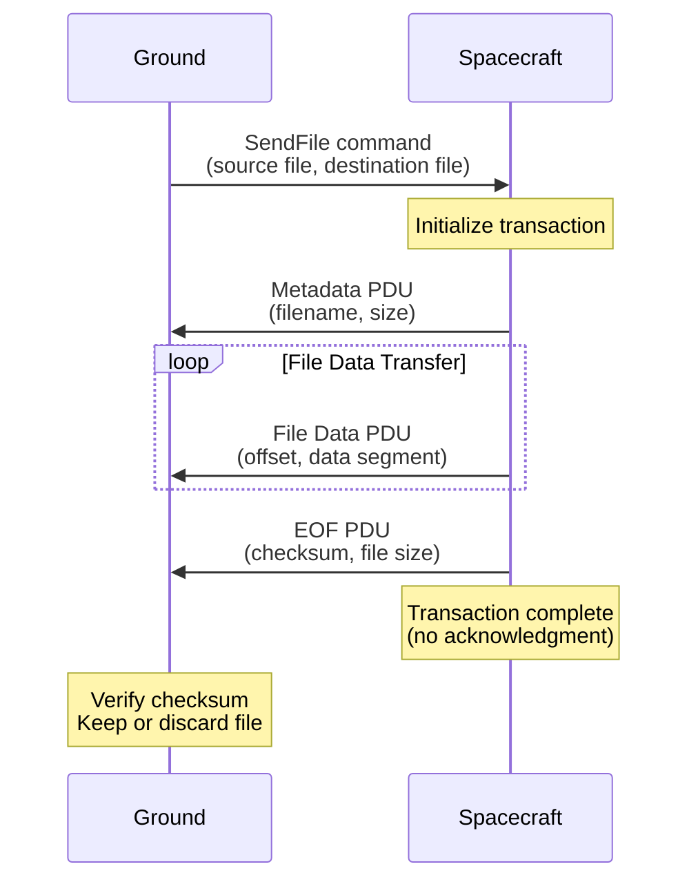
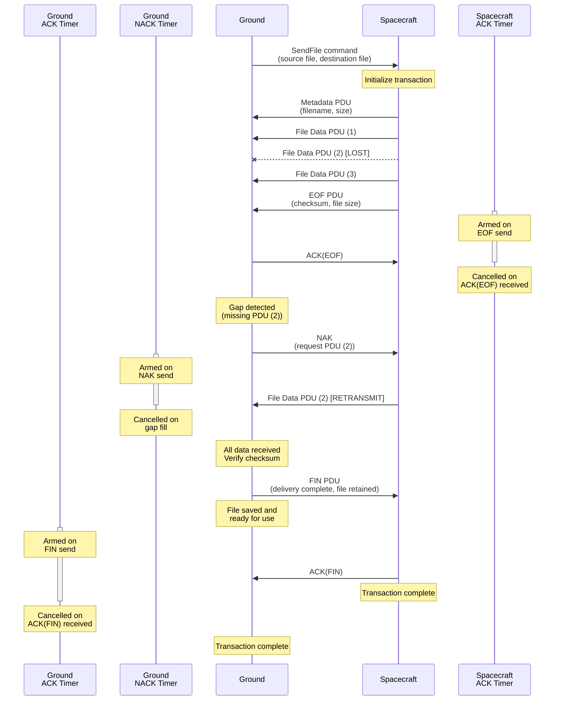
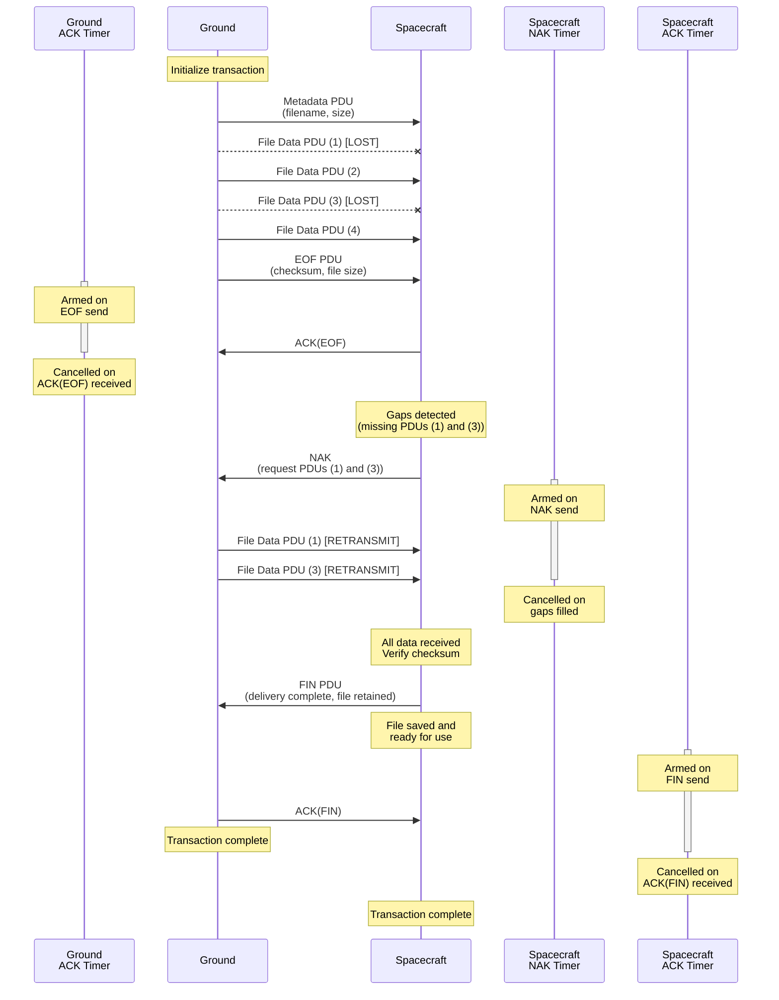

# Ccsds::CfdpManager

## What is CFDP?

The CCSDS File Delivery Protocol (CFDP) is a space communication standard designed for reliable, autonomous file transfer in space missions. CFDP provides a robust mechanism for transferring files between ground systems and spacecraft even in environments with long propagation delays, intermittent connectivity, or high error rates.

CFDP is particularly well-suited for:
- Spacecraft-to-ground file transfers: Downlinking F' event logs, telemetry data files, science data products, and diagnostic files
- Ground-to-spacecraft file transfers: Uplinking F' flight software updates, parameter files, and command sequences
- Delay-tolerant and disruption-tolerant delivery: Automatic retry and recovery mechanisms for challenging communication links

The protocol supports two operational modes:
- Class 1 (Unacknowledged): Unreliable transfer with no acknowledgments, suitable for real-time or non-critical data where speed is prioritized
- Class 2 (Acknowledged): Reliable transfer with acknowledgments, retransmissions, and gap detection, ensuring complete and verified file delivery

### Protocol Data Units (PDUs)

CFDP uses Protocol Data Units (PDUs) - structured messages with a common header and type-specific payloads:

File Directive PDUs (control messages):
- Metadata: Initiates transfer with filenames, file size, and options
- EOF: Signals completion of file transmission with checksum
- FIN: Reports final delivery status (Class 2 only)
- ACK: Confirms receipt of EOF or FIN (Class 2 only)
- NAK: Requests retransmission of missing segments (Class 2 only)

File Data PDU: Carries file content segments with offset information

For complete protocol details, refer to the [CCSDS 727.0-B-5 - CCSDS File Delivery Protocol (CFDP)](https://ccsds.org/Pubs/727x0b5e1.pdf) Blue Book specification.

## CFDP as an F' Component

The CfdpManager component provides an F' implementation of the CFDP protocol and is designed to replace the standard F' [FileUplink](../../../FileUplink/docs/sdd.md) and [FileDownlink](../../../FileDownlink/docs/sdd.md) components with the addition of guaranteed file delivery. CfdpManager implements the CFDP Class 2 protocol with acknowledgments, retransmissions, and gap detection to ensure reliable file transfers even over lossy or intermittent communication links.

Substantial portions of this implementation were ported from [NASA's CF (CFDP) Application in the Core Flight System (cFS) version 3.0.0](https://github.com/nasa/CF/releases/tag/v3.0.0). The ported code includes:
- Core CFDP engine and transaction management logic
- Protocol state machines for transmit and receive operations
- Utility functions for file handling and resource management
- Chunk and gap tracking for Class 2 transfers

The F' implementation adds new components built specifically for the F' ecosystem:
- CfdpManager component wrapper: Integrates CFDP into F' architecture with standard port interfaces, commands, events, telemetry, and parameters
- Object-oriented PDU encoding/decoding: Type-safe PDU classes based on F' `Serializable` interface for consistent serialization
- F' timer implementation: Uses F' time primitives for protocol timers

For detailed attribution, licensing information, and a breakdown of ported vs. new code, see [ATTRIBUTION.md](../ATTRIBUTION.md).

## Class Diagram

The CfdpManager component diagram shows the port organization by functional grouping:

Ports are organized as follows:
- **Top (System Ports)**: Scheduling and system health - `run1Hz`, `pingIn`, `pingOut`
- **Left (Uplink Ports)**: Receive CFDP PDUs from remote entities - `dataIn`, `dataInReturn`
- **Right (Downlink Ports)**: Send CFDP PDUs to remote entities - `dataOut`, `dataReturnIn`, `bufferAllocate`, `bufferDeallocate`
- **Bottom (File Transfer Ports)**: Port-based file send interface - `fileIn`, `fileDoneOut`

### Port Descriptions

#### System Ports

| Name | Type | Port Type | Description |
|------|------|-----------|-------------|
| run1Hz | async input | `Svc.Sched` | Scheduler port that must be invoked at 1 Hz to drive CFDP protocol timer logic, transaction processing, and state machine execution |
| pingIn | async input | `Svc.Ping` | Health check input port for liveness monitoring |
| pingOut | output | `Svc.Ping` | Health check output port for responding to pings |

#### Downlink Ports

| Name | Type | Port Type | Description |
|------|------|-----------|-------------|
| dataOut | output array[N] | `Fw.BufferSend` | Send encoded CFDP PDU data buffers to downstream components. One port (`N`) per CFDP channel. |
| dataReturnIn | async input array[N] | `Svc.ComDataWithContext` | Receive buffers previously sent via `dataOut` after downstream processing is complete. One port per CFDP channel. |
| bufferAllocate | output array[N] | `Fw.BufferGet` | Request allocation of buffers for constructing outgoing CFDP PDUs. One port (`N`) per CFDP channel. |
| bufferDeallocate | output array[N] | `Fw.BufferSend` | Return/deallocate buffers that were allocated but not sent (e.g., due to errors). One port (`N`) per CFDP channel. |

#### Uplink Ports

| Name | Type | Port Type | Description |
|------|------|-----------|-------------|
| dataIn | async input array[N] | `Fw.BufferSend` | Receive incoming CFDP PDU data buffers from upstream components (e.g., frame deencapsulation, radio). One port (`N`) per CFDP channel. |
| dataInReturn | output array[N] | `Fw.BufferSend` | Return buffers received via `dataIn` after PDU processing is complete. One port (`N`) per CFDP channel. |

#### File Transfer Ports

| Name | Type | Port Type | Description |
|------|------|-----------|-------------|
| fileIn | guarded input | `Svc.SendFileRequest` | Programmatic file send request interface. Allows other components to initiate CFDP file transfers without using commands. Transaction arguments are populated as follows: (1) `channelId` and `destEid` are read from component parameters `PORT_DEFAULT_CHANNEL` and `PORT_DEFAULT_DEST_ENTITY_ID`, (2) `cfdpClass` is hardcoded to `CLASS_2` , (3) `keep` is hardcoded to `KEEP`, (4) `priority` is hardcoded to `0` (highest priority). The `offset` and `length` parameters are currently unsupported and must be `0`, or `STATUS_INVALID` is returned|
| fileDoneOut | output | `Svc.SendFileComplete` | Asynchronous notification of file transfer completion for transfers initiated via `fileIn` port. Provides final transfer status. Only invoked for port-initiated transactions (not command-initiated). |

## Usage Examples

The following diagram shows typical CfdpManager port connections with other F' components:

This example demonstrates:
- **Uplink data flow**: FprimeRouter deframes incoming CFDP PDUs and sends them to CfdpManager via `dataIn`
- **Downlink data flow**: CfdpManager sends outgoing CFDP PDUs to ComQueue via `dataOut` for transmission
- **Port-based file transfers**: DpCatalog initiates file transfers via CfdpManager's `fileIn` port and receives completion notifications via `fileDoneOut`

## Component Design

The CfdpManager implementation follows a hierarchical architecture with clear separation of concerns:

### Main Class Hierarchy

CfdpManager ([CfdpManager.hpp](../CfdpManager.hpp))
- Top-level F' component that integrates CFDP into the F' framework
- Provides F' port handlers for commands, data input/output, and periodic execution
- Owns a single Engine instance and delegates all protocol operations to it
- Manages component parameters and provides events/telemetry to the F' system

Engine ([Engine.hpp](../Engine.hpp))
- Core protocol engine that manages CFDP lifecycle and operations
- Owns multiple Channel instances (one per configured CFDP channel)
- Handles PDU routing and dispatching to appropriate transactions
- Manages transaction creation, initialization, and cleanup
- Implements top-level protocol state machine coordination

Channel ([Channel.hpp](../Channel.hpp))
- Encapsulates channel-specific operations and configuration
- Owns a pool of Transaction instances for that channel
- Manages playback directories and polling directories
- Handles transaction queuing with priority-based scheduling
- Controls flow state (normal/frozen) and PDU throttling

Transaction ([Transaction.hpp](../Transaction.hpp))
- Represents individual file transfer operations
- Implements both TX (transmit) and RX (receive) state machines
- Handles Class 1 (unacknowledged) and Class 2 (acknowledged) protocol states
- Implementation split across [TransactionTx.cpp](../TransactionTx.cpp) and [TransactionRx.cpp](../TransactionRx.cpp)
- Manages file I/O, checksums, timers, and retry logic for each transaction

### PDU Type Hierarchy

PduBase ([Types/PduBase.hpp](../Types/PduBase.hpp))
- Abstract base class for all CFDP Protocol Data Units
- Inherits from F' `Fw::Serializable` for consistent encoding/decoding
- Contains common `PduHeader` with transaction identification

Concrete PDU types (all in [Types/](../Types/) directory):
- MetadataPdu ([MetadataPdu.hpp](../Types/MetadataPdu.hpp)): Initiates file transfer with filename, size, and options
- FileDataPdu ([FileDataPdu.hpp](../Types/FileDataPdu.hpp)): Carries file data segments with offset information
- EofPdu ([EofPdu.hpp](../Types/EofPdu.hpp)): Signals end of file transmission with checksum and final size
- FinPdu ([FinPdu.hpp](../Types/FinPdu.hpp)): Indicates transaction completion with delivery status (Class 2 only)
- AckPdu ([AckPdu.hpp](../Types/AckPdu.hpp)): Acknowledges receipt of EOF or FIN directives (Class 2 only)
- NakPdu ([NakPdu.hpp](../Types/NakPdu.hpp)): Requests retransmission of missing file segments (Class 2 only)

### Supporting Types and Utilities

**Classes:**
- Timer ([Timer.hpp](../Timer.hpp)): CFDP timer implementation using F' time primitives for ACK timeouts and inactivity detection
- CfdpChunkList ([Chunk.hpp](../Chunk.hpp)): Gap tracking for Class 2 transfers; tracks received file segments and identifies missing data for NAK generation
- Clist ([Clist.hpp](../Clist.hpp)): Intrusive circular linked list for efficient transaction queue management

**Structs (defined in [Type.hpp](../Types/Types.hpp)):**
- History: Transaction history records for completed transfers; stores filenames, direction, status, and entity IDs
- Playback: Playback request state for directory playback and polling operations; manages directory iteration and transaction parameters
- CfdpChunkWrapper: Wrapper around CfdpChunkList for pooling and reuse across transactions

**Utilities:**
- Utils ([Utils.hpp](../Utils.hpp)): Utility functions for transaction traversal, status conversion, and protocol helpers

## Sequence Diagrams

The following sequence diagrams illustrate the external protocol exchanges between spacecraft and ground systems during CFDP transactions. These diagrams focus on the PDU-level interactions and do not depict the internal state machine transitions, timer management, or detailed transaction processing logic within the CfdpManager component.

### Class 1 TX Transaction (Unacknowledged)

This diagram shows a Class 1 file transmission from spacecraft to ground. Class 1 is unacknowledged and provides no retransmission or delivery guarantees.

**Key characteristics:**
- No acknowledgments (ACK, NAK, or FIN PDUs)
- No retransmissions or gap detection
- Sender completes immediately after sending EOF
- Receiver validates checksum and keeps/discards file independently

### Class 2 TX Transaction (Acknowledged)

This diagram shows a Class 2 file transmission from spacecraft to ground with gap detection and retransmission. The scenario includes a missing File Data PDU that is detected and retransmitted via NAK.

**Key characteristics:**
- Full acknowledgment and retransmission support
- EOF is acknowledged to confirm reception
- Ground detects missing data and sends NAK with gap information
- Spacecraft retransmits requested segments
- FIN PDU from receiver confirms final delivery status
- Timers ensure protocol progress and detect failures
  - Spacecraft ACK timer: Armed when EOF is sent, cancelled when ACK(EOF) or FIN is received. If the timer expires before receiving acknowledgment, the spacecraft retransmits EOF and rearms the timer. After `ChannelConfig.ack_limit` retries without acknowledgment, the transaction is abandoned with status `ACK_LIMIT_NO_EOF`
- Transaction completes only after FIN/ACK exchange

### Class 2 RX Transaction (Acknowledged)

This diagram shows a Class 2 file reception at the spacecraft from ground with gap detection and retransmission. The scenario includes a missing File Data PDU that is detected and retransmitted via NAK.

**Key characteristics:**
- Full acknowledgment and retransmission support
- EOF is acknowledged to confirm reception
- Spacecraft detects missing data and sends NAK with gap information
- Ground retransmits requested segments
- FIN PDU from receiver confirms final delivery status
- Timers ensure protocol progress and detect failures
  - Spacecraft NAK timer: Armed when NAK is sent, cancelled when **all** requested data is received. If the timer expires before receiving retransmitted data, the spacecraft sends another NAK and rearms the timer. After `ChannelConfig.nack_limit` retries without data, the transaction is abandoned with status `NAK_LIMIT_REACHED`
  - Spacecraft ACK timer: Armed when FIN is sent, cancelled when ACK(FIN) is received. If the timer expires, the spacecraft retransmits FIN and rearms the timer. After `ChannelConfig.ack_limit` retries without ACK(FIN), the transaction is abandoned
- Transaction completes only after FIN/ACK exchange

## Commands
| Name | Description |
|---|---|
| SendFile | Initiates a CFDP file transaction to send a file to a remote entity. Specifies channel, destination entity ID, CFDP class (1 or 2), file retention policy, priority, source filename, and destination filename. |
| PlaybackDirectory | Starts a directory playback operation to send all files from a source directory to a destination directory on a remote entity. Files are sent sequentially as individual CFDP transactions. Completes when all files in the directory have been processed. |
| PollDirectory | Establishes a recurring directory poll that periodically checks a source directory for new files and automatically sends them to a destination directory on a remote entity. Poll interval is configurable in seconds. |
| StopPollDirectory | Stops an active directory poll operation identified by channel ID and poll ID. |
| SetChannelFlow | Sets the flow control state for a specific CFDP channel. Can freeze (pause) or resume PDU transmission on the channel. |

## Parameters
| Name | Description |
|---|---|
| LocalEid | Local CFDP entity ID used in PDU headers to identify this node in the CFDP network |
| OutgoingFileChunkSize | Maximum number of bytes to include in each File Data PDU. Limits PDU size for transmission |
| RxCrcCalcBytesPerWakeup | Maximum number of received file bytes to process for CRC calculation in a single execution cycle. Prevents blocking during large file verification |
| TmpDir | Directory path for storing temporary files during receive (RX) transactions. Files are moved to final destination upon successful completion |
| FailDir | Directory path for storing files from polling operations that failed to transfer successfully |
| PortDefaultChannel | Default CFDP channel ID used for file transfers initiated via the `fileIn` port interface (not commands) |
| PortDefaultDestEntityId | Default destination entity ID used for file transfers initiated via the `fileIn` port interface |
| ChannelConfig.ack_limit | Maximum number of ACK retransmission attempts before abandoning a transaction. Applies when waiting for ACK(EOF) or ACK(FIN) acknowledgments |
| ChannelConfig.nack_limit | Maximum number of NAK retransmission attempts before abandoning a transaction. Applies when waiting for retransmitted file data after sending NAK |
| ChannelConfig.ack_timer | ACK timeout duration in seconds. Determines how long to wait for ACK(EOF) or ACK(FIN) before retransmitting |
| ChannelConfig.inactivity_timer | Inactivity timeout duration in seconds. Transaction is abandoned if no PDUs are received within this period |
| ChannelConfig.dequeue_enabled | Enable or disable transaction dequeuing and processing for this channel. Can be used to pause channel activity |
| ChannelConfig.move_dir | Directory path to move source files after successful TX (transmit) transactions when keep is set to DELETE. If set, provides an archive mechanism to preserve files instead of deleting them. If empty or if the move fails, source files are deleted from the filesystem. Only applies to sending files, not receiving |
| ChannelConfig.max_outgoing_pdus_per_cycle | Maximum number of outgoing PDUs to transmit per execution cycle. Throttles transmission rate to prevent overwhelming downstream components |

## Telemetry
| Name | Description |
|---|---|
|---|---|

## Requirements
Add requirements in the chart below
| Name | Description | Validation |
|---|---|---|
|---|---|---|

