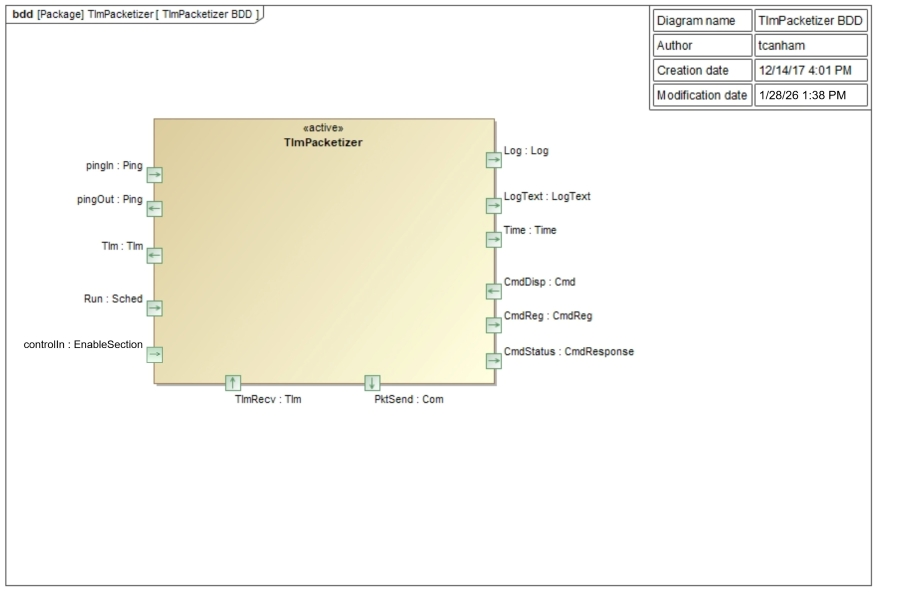
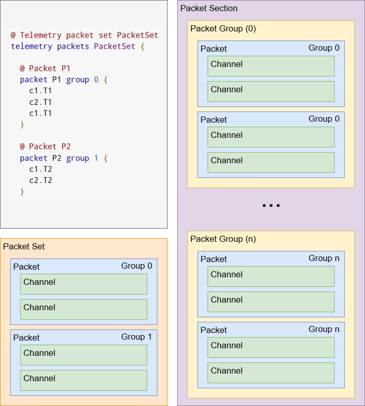

# Svc::TlmPacketizer Component

## 1. Introduction

The `Svc::TlmPacketizer` Component is used to store telemetry values written by other components. The values are stored in serialized form. TlmPacketizer differs from `Svc::TlmChan` in that it stores telemetry in defined packets instead of streaming the updates as they come. The defined packets are passed in as a table to the `setPacketList()` public method. When telemetry updates are passed to the component, they are placed at the offset in a packet buffer defined by the table. When the `run()` port is called, all the defined packets are sent to the output port with the most recent values. This is meant to replace `Svc::TlmCham` for use cases where a more compact packet format is desired. The disadvantage is that all channels are pushed whether or not they have been updated.

Users can change the individual rates at which telemetry groups are output upon a `run()` sched tick for each telemetry section. Each group for each section has independently configurable telemetry resampling rates. Packets can be sent on change with a rate limiting enforced minimum number of ticks between updates. Alternatively, packets can be sent with at a guaranteed rate of a maximum number of ticks between updates. Packets are evaluated individually and have a counter since last invocation. The minimum (MIN) and maximum (MAX) sched ticks between sent telemetry of the same group is configurable, and users can configure groups within each section to apply logic using none, MIN, MAX, or both.

## 2. Requirements

The requirements for `Svc::TlmPacketizer` are as follows:

| Requirement | Description | Verification Method |
|---|---|---|
| TPK-001 | The `Svc::TlmPacketizer` component shall provide an interface to submit telemetry | Unit Test |
| TPK-002 | The `Svc::TlmPacketizer` component shall time tag each packet | Unit Test |
| TPK-003 | The `Svc::TlmPacketizer` component shall keep the latest value of each channel | Unit Test |
| TPK-004 | The `Svc::TlmPacketizer` component shall uniquely identify each packet | Unit Test |
| TPK-005 | The `Svc::TlmPacketizer` component shall write packets upon fulfilling the rate send configurations for its group | Unit Test |

## 3. Design

### 3.1 Context

#### 3.1.1 Component Diagram

The `Svc::TlmPacketizer` component has the following component diagram:

#### 3.1.2 Ports

The `Svc::TlmPacketizer` component uses the following port types:

Port Data Type | Name | Direction | Kind | Usage
-------------- | ---- | --------- | ---- | -----
[`Svc::Sched`](../../Sched/docs/sdd.md) | Run | Input | Asynchronous | Execute a cycle to write changed telemetry channels\r
[`Fw::Tlm`](../../../Fw/Tlm/docs/sdd.md) | TlmRecv | Input | Synchronous Input | Update a telemetry channel\r
[`Fw::Com`](../../../Fw/Com/docs/sdd.md) | PktSend | Output | n/a | Write a set of packets with updated telemetry\r
[`Svc::EnableSection`](../../Ports/TlmPacketizerPorts/sdd.md) | controlIn | Input | Asynchronous | Enable / Disable sections of telemetry groups\r

#### 3.1.3 Terminology
Telemetry Point: An emitted value.
Telemetry Channel: A tagged type, identifier, and timestamp for emitting telemetry points.
Telemetry Packets: A group of telemetry channels.
Telemetry Group / Level: An identifier specifying a set of packets to get transmitted together.
Telemetry Section: A resampling of telemetry groups. Each Section typically is destined for a different destination (e.g. realtime downlink vs store & forward)

The following example demonstrates the structure composition of packet set specifications and packet sections used in `Svc::TlmPacketizer`. While multiple packet sets can have packets with different group identifiers, a section contains all packets partitioned based on group identifier.

#### 3.2 Functional Description

The `Svc::TlmPacketizer` component has an input port `TlmRecv` that receives channel updates from other components in the system. These calls from the other components are made by the component implementation classes, but the generated code in the base classes takes the type specific channel value and serializes it, then makes the call to the output port. The `Svc::TlmPacketizer` component can then store the channel value as generic data. The channel ID is used to look up offsets for the channel in each of the defined packets. A channel can be defined in more than one packet. The time tag is stripped from the incoming telemetry value. The time tag of the channel will become the time tag of the entire frame when it is sent.

The implementation uses a hashing function to find the location of telemetry channels that is tuned in the configuration file `TlmPacketizerImplCfg.hpp`. See section 3.5 for description.

When a call to the `Run()` interface is called, the packet writes are locked and all the packets are copied to a second set of packets. Once the copy is complete, the packets writes are unlocked. The destination packet set gets updated with the current time tag and are sent out the `pktSend` port.

Each telemetry group, depending on section and group configurations, are sent out on several indices of the `pktSend` port. Since each section holds a continuous range of ports, a packet with group 1 with a TlmPacketizer configuration of 3 sections (0, 1, and 2), and a max group of 3 (0 and 3 inclusive), will be sent on 3 indices: 1, 5, and 9. Port invocations to `controlIn` or the command, `ENABLE_SECTION` are used to enable / disable each section, supporting downstream components that rely on different samplings of groups of telemetry. Each group instance is separately sampled from each other, allowing for individual rates per section and group.

### 3.3 Scenarios

#### 3.3.1 External User Option

#### 3.3.2 Configuring Telemetry Group Rates Per Port

The `Svc::TlmPacketizer` is configurable to have multiple `PktSend` group outputs using the fpp constant, `MAX_CONFIGURABLE_TLMPACKETIZER_GROUP`. Doing so allows each packet group have different configurations for each `PktSend` output section.

`PktSend` output is ordered by `[section][group]`, where within each section telemetry groups are emitted. Each group within each section are separately sampled, and have their own configuration rates and logic independent from each other.

Each group is configured with min/max delta parameters, as well as a logic gate determining its output rate behavior. Deltas are counters of schedule ticks invoked through the `run()` port. Min Delta is the least number of `Run()` invocations between successive packets before a packet with an updated channel is allowed to be sent. Updated packets will not be sent until their counter reaches Min Delta. This mitigates against telemetry spam while allowing users to benefit from asynchronously updating channels (e.g. those that don't occupy a set schedule). Max Delta is the maximum number of `Run()` invocations between successive packets. Upon reaching this counter, the packet would be sent, regardless of change.

Each telemetry group per section is configured with a `RateLogic` parameter:
* `SILENCED`: Packet will never be sent
* `EVERY_MAX`: Packet will be sent every Max Delta intervals
* `ON_CHANGE_MIN`: Packet will only be sent on updates at at least Min Delta intervals.
* `ON_CHANGE_MIN_OR_EVERY_MAX`: Packet will be sent on updates at at least Min Delta intervals, or at most Max Delta intervals.

Note: `MAX` will take priority over `MIN` if less than `MIN` and the telemetry group is set to `ON_CHANGE_MIN_OR_EVERY_MAX`. 

Groups are configured using the `CONFIGURE_GROUP_RATES` command.

#### 3.3.3 Switching Telemetry Sections
`Svc::TlmPacketizer` also has a configurable constant `TelemetrySection::NUM_SECTIONS` that allows separately streamed outputs of packets of the same group. This is useful for downstream components that would handle different telemetry groups at different rates. Examples of this configuration includes live telemetry throughput, detailed sim reconstruction, or critical data operations.

Telemetry sections are enabled and disabled upon spacecraft state transitions through `controlIn()` port invocations or via operator commands. A section and group pair must be both enabled to emit a telemetry packet.
* `ENABLE_SECTION` / `controlIn()`: Enable / Disable telemetry sections.
* `ENABLE_GROUP`: Within a section, Enable / Disable a telemetry group.
* `FORCE_GROUP`: If set to Enabled, telemetry of the chosen group in a section will be emitted regardless if the section or group within the section is disabled.

Disabling groups / sections will freeze the group's counter between sent output.
Updated groups using `ON_CHANGE_MIN` or `ON_CHANGE_MIN_OR_EVERY_MAX` while group disabled / section disabled will be marked "NEW" but not sent. The group counter resumes once the group / section is re-enabled and will be sent upon reaching their MIN counter.

### 3.4 State

`Svc::TlmPacketizer` has no state machines.

### 3.5 Algorithms

In order to speed up lookups for storing and reading telemetry channels, a simple hash function is used to select a location in an array of hash table slots.
A configuration value in `TlmPacketizerImplCfg.h` defines a set of hash buckets to store the telemetry values. The number of buckets has to be at least as large as the number of telemetry channels defined in the system. The number of channels in the system can be determined by invoking `make comp_report_gen` from the deployment directory. The number of has table slots `TLMPACKETIZER_NUM_TLM_HASH_SLOTS` and the hash value `TLMPACKETIZER_HASH_MOD_VALUE` in the configuration file can be varied to balance the amount of memory for slots versus the distribution of buckets to slots. See `TlmPacketizerImplCfg.h` for a procedure on how to tune the algorithm.

## 4. Dictionaries

## 5. Module Checklists

## 6. Unit Testing

To see unit test coverage run fprime-util check --coverage

## 7. Change Log

Date | Description
---- | -----------
12/14/2017 | Initial version
01/23/2026 | Added group level rate logic

