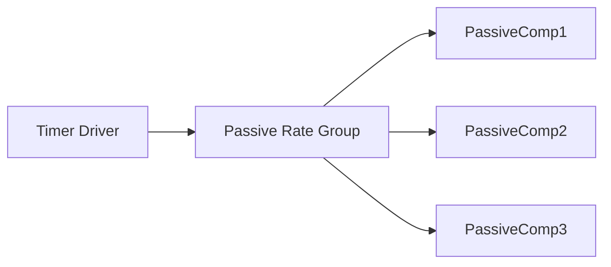

# F´ on Baremetal Systems

The baremetal pattern enables F´ applications to run on processors without an operating system. This pattern is designed for resource-constrained environments where traditional OS features like threads and message queues are unavailable.

## What is Baremetal?

"Baremetal" is defined as a processor/application that does not run with an operating system. In baremetal environments:

- There is no software provided to run processes or threads
- Resources are usually constrained (RAM, storage)
- There is one point of entry
- Interrupt service routines (ISR) can be used

## F´ and Baremetal

F´ does not require an operating system. Applications can be written entirely as a set of passive components with one Timer component driving the entire application through passive rate groups. However, using many of the standard F´ components (e.g. `active` components) do require operating system abstraction (OSAL) support. 

The baremetal pattern provides a solution that allows F´ core components to be used in baremetal deployments while adapting to the constraints of the environment.  It provides information on how to support baremetal with components written for complete OSAL adaptations.

### The Joy of Passive Components

First and foremost, baremetal F´ systems should avoid using **Active Components** where possible because these components require quasi-asynchronous execution contexts in which to run. i.e. they need threads such that they can execute in "parallel" with each other. This means using `passive` or `queued` components driven by rate groups or cycled on the main thread.

> [!NOTE]
> If you **must** use **Active Components** you should thoroughly review the [Thread Virtualization](#thread-virtualization) section of this document

If your system can be entirely defined by `passive` and `queued` components then implicitly every port **invocation** would be eventually run in a synchronous call and the execution context would be entirely delegated to every component. Thus the need for a thread scheduler would disappear. A discussion of the source of that delegated execution context comes next.

### Architecture

In a baremetal F´ application, components are organized around a passive rate group pattern:



The timer driver invokes the passive rate group at a fixed rate, which then drives the execution of all connected components. Since there are no threads or queues, all components use sync ports and execute synchronously when called.

> [!TIP]
> Typically in baremetal systems `queued` component messages are dispatched via a rate-group with a bounded maximum of message dispatches per invocation.

## Baremetal Features

F´ provides support for baremetal deployments through the [fprime-community/fprime-baremetal](https://github.com/fprime-community/fprime-baremetal) support package, which ships as an F´ library. This package provides passive component implementations and other features described below.

### Baremetal OS

The Os/Baremetal module provides an implementation of the OS abstraction layer (OSAL) to emulate threads, message queues, and other OS features. This allows the use of F´ core components that depend on OS abstractions without requiring a full operating system.

Key characteristics:

- Emulates OS features like threads
- Provides compatibility with the F´ OSAL model

> [!CAUTION]
> Users requiring thread emulation should read [Thread Virtualization](#thread-virtualization) for an experimental approach using protothreading.

### MicroFs

MicroFs provides an in-memory basic file system for components that need file access:

- Provides basic file system operations
- Stores files in RAM
- Only persists as long as the processor is powered
- For less constrained environments with flash storage, users can write or use their own file system or wrap a third-party library

## Configuration and Tuning

F´ provides configuration options to optimize for the constrained environments of baremetal deployments. These options are useful to minimize the code size, memory footprint, and other resources.

### F´ Configuration

F´ has numerous configuration options to scale the size of F´ down for resource-constrained environments. These are found in the project's copy of the `default/config` directory. For complete configuration details, see [User Guide: Configuring F´](../framework/configuring-fprime.md).

Example configuration options include the following:

- Turn features on and off
- Specify various buffer and storage sizes
- Many other options

### Port Call Optimization

F´ provides alternate code generation for port connections to eliminate some of the abstraction layers, reducing overhead in resource-constrained environments. This feature is currently in alpha.

## Implementation Suggestions

When implementing a baremetal F´ application, consider the following:

### Component Organization

Develop components based on the [Rate Group pattern](../design-patterns/rate-group.md):

- Have it driven by a hardware timer at the necessary rate
- Use PassiveRateGroup to drive a set of components (including F´ core components)
- All components should use passive ports for reasons discussed above.

### Scale F´ Features

Minimize resource usage by:

- Turning off port serialization if not needed
- Scaling command tables and telemetry storage to minimum size needed
- Adjusting buffer sizes to match actual requirements
- Disabling unused features

### Choose an Execution Context

Ensuring that some call invokes all of the **Components** that compose the F´ system is key to running a baremetal system. Otherwise, some components will not run. Typically, this is handled by composing an F´ baremetal system into components that are all driven by [rate groups](../design-patterns/rate-group.md). Additionally, users could call components from the main thread.

Designing the system this way ensures that all execution is derived from one source: the rate group driver and thus reducing the problem to supplying an execution context to the rate group driver at a set rate. All calls needed will execute during a sweep through the rate groups and their derived rates.

> [!NOTE]
> Other options exist (see [Thread Virtualization](#thread-virtualization) below), however; these methods **still** require a context to run in.

Although a full discussion of supplying execution context to the rate group driver is outside the scope of this
documentation, here are a few tips. i.e. embedded software typically looks like the following and the loop-forever `execute();` action should trigger the rate group driver at a set interval.

```C
// Run once setup
setup();

// Do this forever
while (true) {
   execute(); // Cycle rate groups, and or thread virtualization here.
}
```

Now all that is required is to determine when this interval has elapsed. This can be done by spinning on a hardware clock
signal, calculating elapsed time by the reading of clock registers, using timing library functions, the `sleep()` call, or
by a timer-driven interrupt service routine (ISR).

> [!NOTE]
> ISRs are complex items and should be studied in detail before going this route. Notably, the ISR should not execute the rate group directly, but rather should set a flag or queue a start message and allow the `while (true) {}` spin in the main loop to detect this signal and start the rate groups.

## Thread Virtualization

> [!NOTE]
> This is a specialized technology with respect to F´. Care to understand its implementation should be taken before using it in a production/flight context.

Some systems, even baremetal systems, require the use of **Active Components**. Many of the `Svc` components are by design active components. It is impractical to assume that all projects can, at the moment of conception, discard all use of the framework provided **Active Components**. Thus F´ was augmented with the ability to virtualize threading, such that projects could use these components during development as they migrate to a fully passive-component system.

The standard baremetal pattern uses only passive components. Thread virtualization is an advanced alternative approach when active components are needed.

To activate this feature see: [Configuring F´](../framework/configuring-fprime.md). Continue reading for all the fancy details of how this system is designed.

### Defining Custom Tasks

When using the thread virtualization technology, care should be taken with custom tasks/threads. This design, as described below, is dependent on threads that "run once" and externalize the looping part of the thread. Therefore, custom tasks must wrap functions that obey the following implementation requirements:

1. The function shall not loop
2. The function shall never block execution
3. The function shall perform "one slice" of the thread and then return

Failure to comply with these requirements will cause the thread virtualization technology to fail, and the F´ application to lock up or otherwise behave erratically.

> [!TIP]
> The F´ active component implementation already obeys these requirements. Users need to obey these expectations w.r.t user defined threads.

### How It Works

At the core of **Active Components** is a thread, which typically requires an Os to provide a scheduler for it to run, and through this scheduler, it gets designated an execution context to run in. Thus threads can execute as if they fully own their execution context and the Os masks this behind the scenes. The purpose of the thread virtualization when enabled for an F´ project is to unroll these threads such that they can share a single execution context and the parallel behavior of the threads is "virtualized". The technique is known as protothreading. We'll explore this concept with relation to F´ below.

Each F´ thread supporting an Active component can be roughly modeled by the code below. The thread loops until the system shuts down. For each iteration through the loop it blocks (pauses execution) until a message arrives. It then dispatches the message and returns to a blocked state waiting for the next message.

```C++
Component1 :: run_thread() {
    while (!shutdown) {
        msg = block_get_message();
        dispatch(msg);
    }
}
```

Here `block_get_messages();` retrieves messages, blocking until one arrives. This loop could have easily been implemented using a less-efficient model by iterating continuously through the loop and checking if a message has arrived and dispatching if and only if a message is available. As can be seen below, the wait-by-blocking has been replaced by the busy wait of constantly iterating through the loop.

```C++
void Component1 :: run_once() {
    if (message_count() > 0) {
        msg = nonblock_get_message();
        dispatch(msg);
    }
    return;
}

Component1 :: run_thread() {
    while (!shutdown) {
        comp1.run_once();
    }
}
```

Here, we extracted the iteration into a `run_once` function for clarity. The blocking wait in the first function is replaced with a spin on an if-condition until a message is available, then the dispatch happens.

It should be only a slight extrapolation that one could move all the component `run_once` functions into a single loop and call each in succession. As long as these calls return in a reasonable amount of time, and none of these calls block internally, then crude parallelism is achieved.

```C++
while (!shutdown) {
    comp1.run_once();
    comp2.run_once();
    comp3.run_once();
    ...
}
```

Here, as seen above, `run_once` does not block and so each component gets a slice of execution time before yielding to the next. Parallelism has been virtualized and the processor is shareable without writing a full-blown thread scheduler nor requiring processor instruction set support to switch threading contexts.

Inside F´ a parallel implementation of the active component task was implemented such that it returns rather than blocks on receiving messages. When `BAREMETAL_SCHEDULER` is enabled in the F´ configuration, this alternate implementation is used. Under `Os/Baremetal`, an implementation of a sequential scheduler exists. This scheduler snoops on task registration and will call all thread executions in a loop driven from the main program loop similar to below.

```C++
setup(); // Setup F´
while (true) {
    scheduler.run_once();
}
```

## Resources

- [`fprime-baremetal-reference`](https://github.com/fprime-community/fprime-baremetal-reference): a reference implementation of a baremetal F´ application
- [`fprime-baremetal`](https://github.com/fprime-community/fprime-baremetal): a support package for baremetal F´
- [F´ on Multi-Core Systems](./run-multi-core.md): guide for multi-core F´ deployments

## Conclusion

The baremetal pattern enables F´ to run on resource-constrained processors without an operating system while still allowing the reuse of F´ core components. By using the Baremetal OS abstraction layer, MicroFs for file operations, and careful configuration tuning, developers can deploy F´ applications on microcontrollers like Arduino and STM32 platforms.
