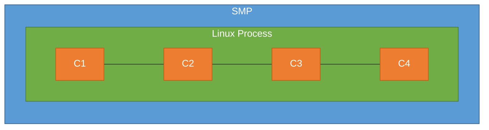
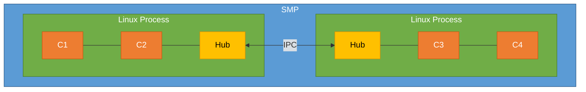
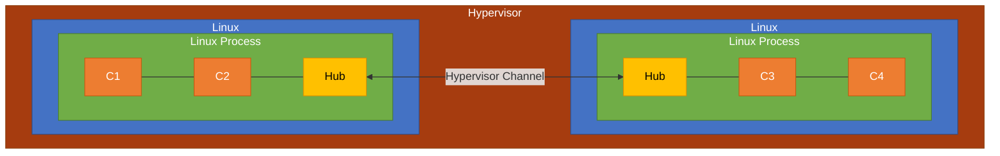

# F´ on Multi-Core Systems

F´ provides support for leveraging multi-core processor architectures in embedded systems. This guide covers the
fundamentals of multi-core processing, how F´ supports it, and practical guidelines for designing multi-core F´
applications.

## Table of Contents

- [Multi-Core Processing Overview](#multi-core-processing-overview)
- [F´ Multi-Core Support](#f-multi-core-support)
- [Multi-Core Processing Guidelines](#multi-core-processing-guidelines)
- [Deployment Patterns](#deployment-patterns)
- [Multi-Device Systems](#multi-device-systems)
- [Related Topics](#related-topics)

## Multi-Core Processing Overview

Many modern processors have multiple processing cores. Each core executes its own code, allowing multiple execution
contexts to run simultaneously. There are two main architectural approaches for managing multi-core systems:

### SMP (Symmetric Multi-Core)

SMP is where one operating system manages all cores as a compute resource. The OS provides APIs to "pin" a thread to a particular
core, or to allow the OS to dynamically assign threads based on loading.

In an SMP system:

- All cores share the same memory space
- A single OS kernel manages all cores
- Threads can be scheduled on any available core
- The OS handles load balancing and core assignment

### AMP (Asymmetric Multi-Core)

AMP is where more than one operating system runs, with a subset of cores assigned to each OS. This is usually managed by a
hypervisor that partitions the cores among different OS instances.

In an AMP system:

- Each OS instance has dedicated cores
- Memory may be partitioned between OS instances
- A hypervisor manages core allocation and isolation
- Inter-OS communication requires special middleware

The operating system provides APIs to control thread-to-core assignment, enabling developers to optimize for specific
performance characteristics.

## F´ Multi-Core Support

F´ provides an API in the OS abstraction layer that allows a thread to be pinned to a specific core. The relevant
interface is defined in `Os/Task.hpp` as part of the `Arguments` class used when starting a task:

```cpp
    //! \param cpuAffinity: (optional) cpu affinity of this task
```

The default behavior is to let the OS dynamically assign the thread to cores. The `cpuAffinity` parameter is delegated to the operating
system implementation, which handles the platform-specific details of core affinity. For example, the Posix OSAL implementation delegates to the `pthread_attr_setaffinity_np` function (see [source]((https://github.com/nasa/fprime/blob/5e1a22edce86133957dfeb54a31ac135b42bb92b/Os/Posix/Task.cpp#L108-L127))).

### Important Considerations

**Synchronization objects** like mutexes are delegated to the OS and are SMP-safe based on the operating system
implementation.

**F´ is not inherently SMP "safe"**. It relies on the OS implementation and developer expertise to ensure safe
multi-core operation. Developers must understand the threading model and synchronization requirements of their
specific deployment.

**Atomic operations**: Some portions of F´ use `U32` types to synchronize between threads. In many systems this is a
safe atomic operation; however, this is not guaranteed in all systems. Projects should verify that their system
behaves as expected. These usages are under review and will be corrected over time.

## Multi-Core Processing Guidelines

Like anything else, there are tradeoffs for SMP, and there are different opinions as to the best approach. Here are
some guidelines for assigning threads to cores based on different optimization goals.

### For Execution Consistency

Assign threads doing a particular function to their own cores. This provides predictable, deterministic behavior.

**Examples:**

- I/O threads vs GNC (Guidance, Navigation, and Control) threads vs data processing threads
- Separate real-time critical threads from background processing threads

**Considerations:**

- For I/O operations, check interrupt assignment to ensure interrupts are routed to the appropriate core
- This approach provides the most deterministic timing behavior
- Best for safety-critical or real-time systems with strict timing requirements

### For Execution Efficiency

Allow the OS to assign threads to cores dynamically. This maximizes CPU utilization and can improve overall
throughput.

**Benefits:**

- The OS picks an idle core when available
- Automatic load balancing across cores
- Better utilization when workload varies over time

**Best used when:**

- Deterministic timing is less critical
- Workload is variable or unpredictable
- Maximum throughput is more important than consistent latency

### For Memory Performance

Assign threads that share large data sets to the same core. This improves memory access patterns and reduces cache
contention.

**Benefits:**

- Avoids cache "thrashing" where data must be moved between core caches
- Improves memory access latency and bandwidth
- Reduces memory bus contention

**Important for:**

- Data-intensive processing
- Applications with large shared data structures
- Systems where memory bandwidth is a bottleneck

### Mixed Patterns

A mixed pattern of pinning some threads and allowing the OS to select for others can work effectively. For example:

- Pin time-critical threads to dedicated cores
- Allow background processing threads to float across remaining cores
- Pin I/O threads to cores that handle related interrupts

### Data Sharing and Reentrancy

Users need to be aware of data-sharing and reentrancy issues when designing multi-core applications. Proper
synchronization mechanisms must be used to protect shared resources.

**Key considerations:**

- Use mutexes or other synchronization primitives for shared data
- Understand the memory model of your target platform
- Be aware of false sharing (multiple threads accessing different data on the same cache line)
- Consider using lock-free data structures where appropriate

## Deployment Patterns

F´ supports several deployment patterns for multi-core systems, depending on whether you are using SMP or AMP
architectures.

### SMP Within a Single Process

For SMP within a single process (e.g., Linux), memory space is shared across all cores.

**Characteristics:**

- No special work is required; use normal messaging between components
- Assign threads to cores based on the guidelines in the previous section
- All F´ components run in the same address space and can communicate directly

**Architecture:**



**Use cases:**

- Standard Linux or RTOS deployments
- Systems where all components can share memory
- Simplest multi-core deployment pattern

### SMP Across Multiple Processes

For SMP across multiple processes, use an F´ Generic Hub with a Linux named message queue or a pipe to pass data
between processes.

**Characteristics:**

- Each process is an F´ deployment
- The Generic Hub component handles inter-process communication
- More advanced patterns can define and combine dictionaries and forward commands and telemetry between processes

**Architecture:**



**Use cases:**

- Isolation between subsystems for safety or security
- Different privilege levels for different components
- Fault containment (process crash doesn't affect other processes)

**Implementation notes:**

- Use Linux IPC mechanisms (message queues, pipes, shared memory)
- Each process has its own F´ deployment
- The Generic Hub pattern enables transparent communication

### AMP with Hypervisor

For AMP, use an F´ Generic Hub with a driver for the hypervisor-provided or other middleware to pass data between AMP
partitions.

**Characteristics:**

- Each partition runs its own OS instance (e.g., Linux)
- Each partition contains an F´ deployment
- The Generic Hub uses a platform-specific driver to communicate across partitions
- The hypervisor manages core allocation and isolation between partitions

**Architecture:**



**Use cases:**

- Safety-critical systems requiring strong isolation
- Mixed-criticality systems (different safety levels)
- Systems with different OS requirements per partition

**Implementation notes:**

- Requires hypervisor support
- Communication typically uses shared memory or hypervisor-provided channels
- Strong isolation between partitions
- More complex setup and configuration

## Multi-Device Systems

When running F´ on multi-device systems (separate physical processors), users typically define a deployment for each
device in the system. These deployments are then linked over the platform's inter-communication architecture. Should
users want F´ execution across these deployments to look like a single F´ deployment, users are advised to adopt the
[hub pattern](../design-patterns/hub-pattern.md) to invoke F´ port calls across multiple devices.

This approach is similar to the multi-process and AMP patterns described above, but operates across physically
separate processors rather than partitions or processes on the same processor.

## Related Topics

- [F´ on Baremetal Systems](run-baremetal.md) - Design pattern for baremetal F´ applications
- [Hub Pattern](../design-patterns/hub-pattern.md) - Design pattern for connecting deployments
- [Configuring F´](configuring-fprime.md) - General F´ configuration options
